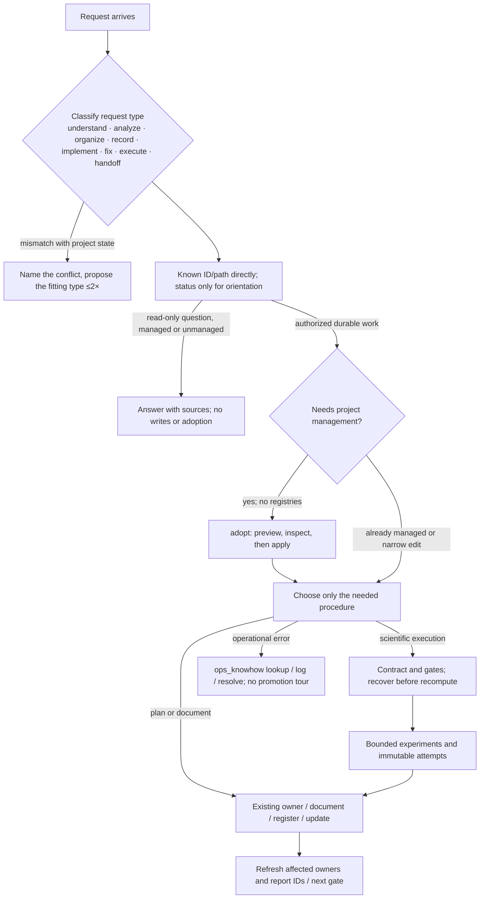

# Quickstart Map — research-skills in one page

Read this for onboarding, not before every task. It tells you what the skill
does, in what order things happen, and which file or command to open for each
need. Everything below is a locator into `SKILL.md`, `references/`,
`scripts/`, and `assets/`; the rules themselves live there.

## What it is

A working discipline for computational research in which files, code, data,
and immutable artifacts are the authority and the chat is only a hint. It
gives durable results a stable id, a claim ceiling, and a next gate, and it keeps
project state readable by a fresh session without re-reading history.

## How a session flows



## The objects you will meet

| object | meaning | id / where it lives |
|---|---|---|
| Direction | a research question thread; may have a parent | `D-…` in `DIRECTION_REGISTRY.tsv` |
| Unit experiment | the only unit of scientific comparison: one question, one comparator, one metric contract, one claim ceiling | `U-…` in `UNIT_EXPERIMENT_REGISTRY.tsv` |
| Attempt | one execution or observation with an immutable artifact; belongs to exactly one unit | `A-…` in `ATTEMPT_REGISTRY.tsv` |
| Campaign / Stage / Batch / Gate | operational envelopes that order, package, and permit work; they never own a verdict | campaign folders and plan receipts |
| Milestone | a frozen decision-bearing result, typed ACHIEVEMENT · NEGATIVE-FINDING · METHOD · INFRASTRUCTURE · DECISION | `MILESTONE_HISTORY.tsv` |
| Claim | one statement with epistemic status, condition fingerprint, and evidence locator | `CLAIM_REGISTER.tsv` |
| STATE.md | the compact current-state capsule; generated block + manual notes | project root |
| LOCATOR-MAP | where builds, runtimes, checkpoints, and result roots live (never numbers) | `PATH_MAP.md` per mission |

## Which part answers which need

| you need to… | open | tool |
|---|---|---|
| know what the user actually wants from this turn | `references/request-classification.md` | judgment |
| see project status without reading documents | `references/state-registry-api.md` | `research_state.py status · show · flow` |
| check whether this was already tried | same | `research_state.py repeat-check` |
| bring an old project or a chat under authorized management | `references/project-records-and-views.md`; `assets/conversation-intake-template.md` | `research_state.py adopt` preview, then apply |
| find a file, id, or passage cheaply | known ID/path directly; `references/local-search.md` + `$local-search` for broader discovery | `research_state.py show/find`, scoped `rg`; tgrep/QMD only if useful |
| decide what a result may claim | `references/evidence-and-validation.md` | — |
| tell a record from the thing it describes | `references/provenance-and-identity.md` | — |
| pivot, pause, or open a branch | `references/hypothesis-graph-and-direction-change.md`; `assets/direction-change-template.md` | — |
| run many comparable measurements | `references/structured-experiment-campaigns.md`; contract/plan/coverage templates | `validate_stage_script.py` for wrappers |
| stop a loop that is not converging | `references/research-loop-and-stop-rules.md` | — |
| record compute, artifacts, and monitors | `references/compute-and-artifacts.md`; `references/research-monitor-dashboard.md` | — |
| keep one owner per claim and correct stale prose | `references/documentation-and-provenance.md` | `audit_research_docs.py` |
| register results and update state | `references/state-registry-api.md`; `references/registration-checklist.md` | `research_state.py register · update · render` |
| render the research history for a decision | `references/research-history-and-loop-visualization.md` | `build_research_history_view.py` |
| track environments across machines | `references/local-environment-tracking.md` | `capture_local_environment.py` |
| record/recover one operational error | `references/operational-error-recording.md` | `operational_knowhow.py lookup/log/resolve` |
| improve a skill from repeated operational incidents | `references/operational-knowhow-lifecycle.md` | `operational_knowhow.py analyze/mark-transferred` |
| manage a project-only rule until it generalizes | `references/temporary-policy-lifecycle.md`; `assets/temporary-policy-template.md` | — |
| bring in papers or an external research report | `references/literature-management.md` | source cards; optional external tools are not bundled |
| reproduce a figure | `references/research-figure-reproducibility.md`; narrow renderer directly, umbrella for multi-type production | — |
| optionally use IBM ado or Graphify | `references/ado-experiment-management.md`, `references/graphify-integration.md` | `init_ado_workspace.py` |
| build the skill's own search corpus | `references/local-search.md` | `setup_local_search.py` |
| map a function to its code | `references/capability-code-map.md` | — |

## Five rules that shape everything

1. Files are authority; chat memory only suggests where to look.
2. One unit experiment answers one question under one contract; attempts and
   campaigns never substitute for it.
3. Every claim has one canonical home, a condition fingerprint, and a claim
   ceiling; stale prose is corrected in place, never silently rewritten.
4. Register durable research records and meaningful failures; read-only
   questions do not authorize writes.
5. Read by ID, not by pasting; use `status` only when project orientation is needed.

## Minimal authorized management setup

Skip this for explanation or analysis alone. Inspect the preview before apply;
do not create units/registries merely to organize an ordinary code edit.

```bash
python3 <research-skills>/scripts/research_state.py --project <root> adopt
python3 <research-skills>/scripts/research_state.py --project <root> adopt --apply
python3 <research-skills>/scripts/research_state.py --project <root> register direction --field title="…" --field question="…" --field status=OPEN --field claim_ceiling="…"
python3 <research-skills>/scripts/research_state.py --project <root> register unit --field direction_id=D-… --field title="…" --field question="…" --field comparator_id="…" --field metric_id="…" --field claim_ceiling="…"
python3 <research-skills>/scripts/research_state.py --project <root> status
```

Project-local rules, registries, generators, and validators belong to the
project (its own `.skills/` or policy documents); this skill supplies the
contracts and tools they plug into.

## No-Python Fallback

When no Python interpreter is available, the file contract still works:

- Read `STATE.md` directly for the current capsule; it mirrors the last
  rendered `status` and `flow` output.
- Look up registry rows by stable id with `rg` on the TSV files under
  `research_organization/` instead of `show`/`find`.
- Preserve an urgent durable record in an `UNVERIFIED` intake Markdown file.
  Only do this when recording is authorized; analysis alone does not create intake.
- In the next Python-capable session, register it, then lint and render.

For folders, document IDs, frozen results, version receipts and project-local
helpers, read [project-records-and-views.md](project-records-and-views.md).
